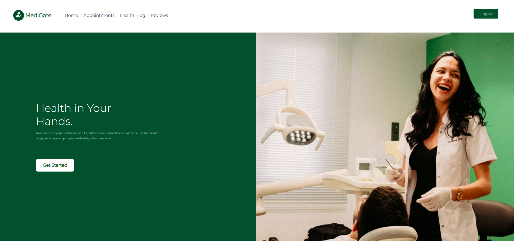
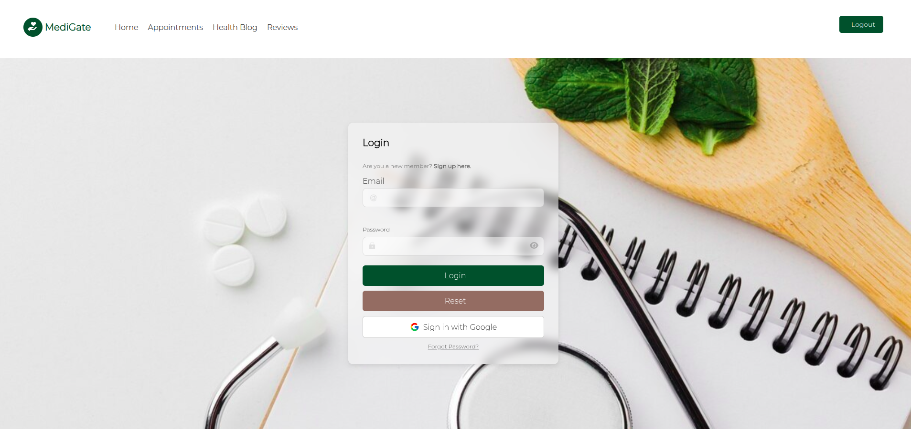
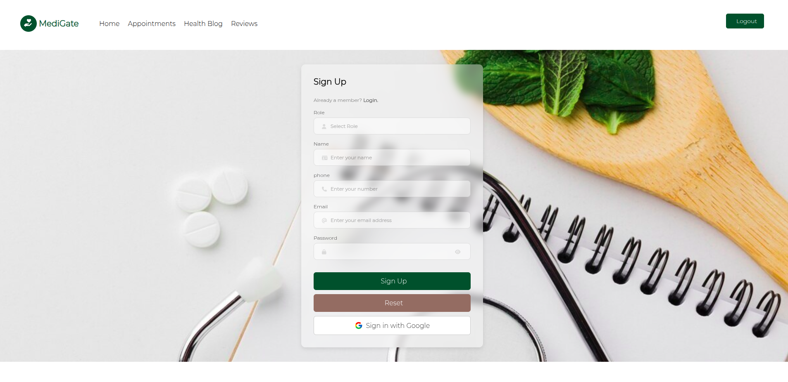
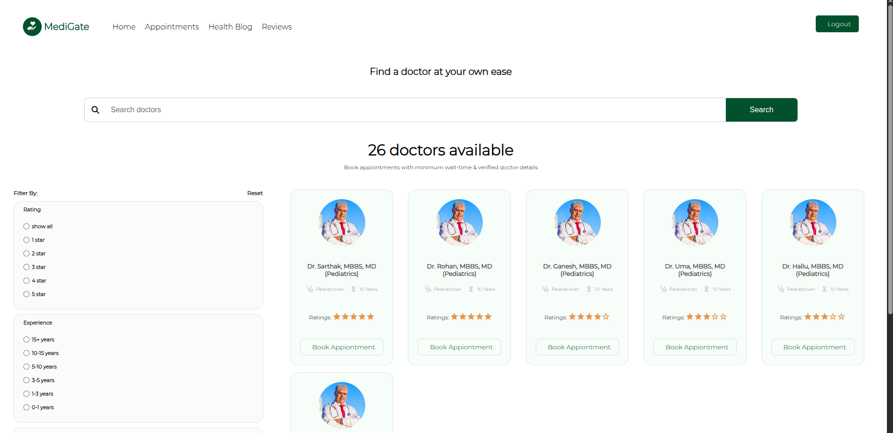
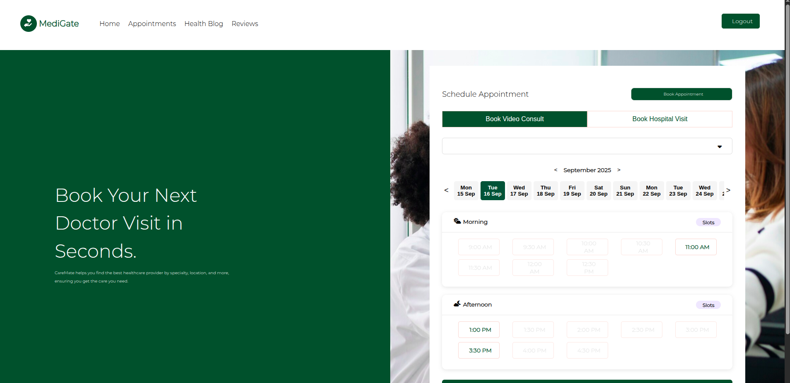
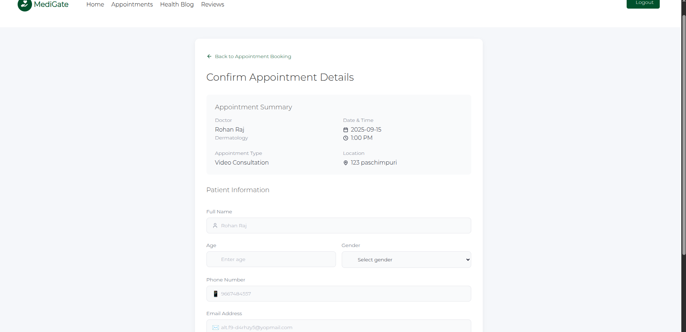
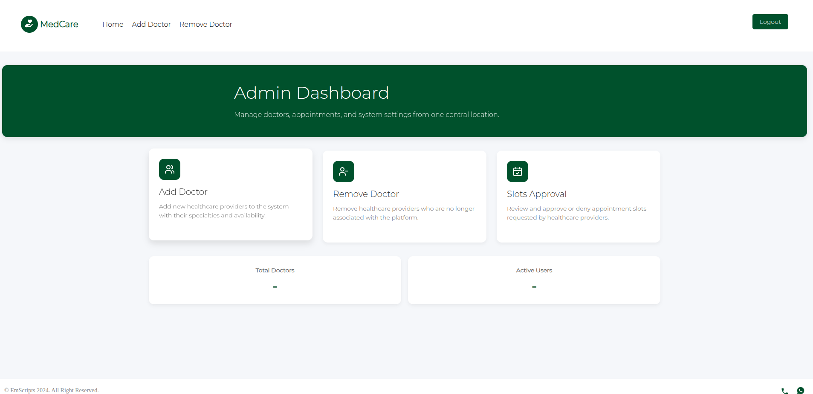
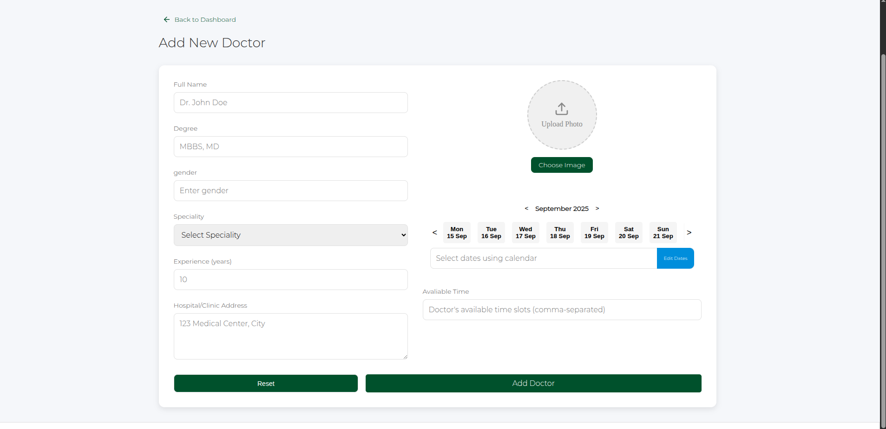
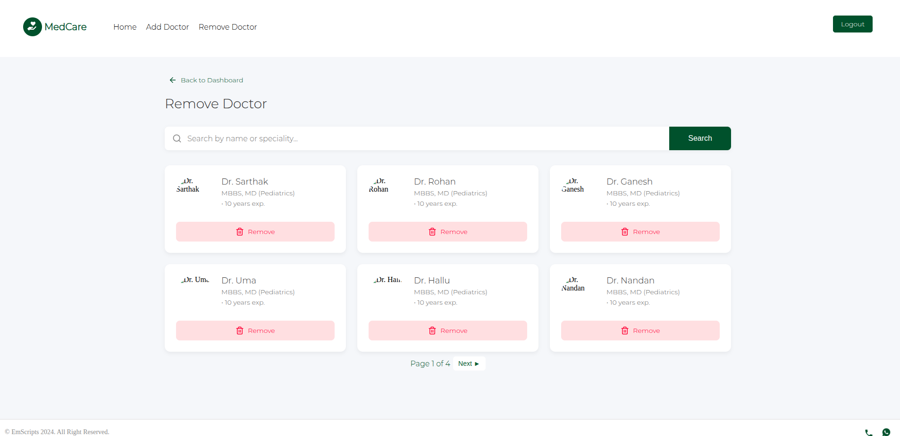
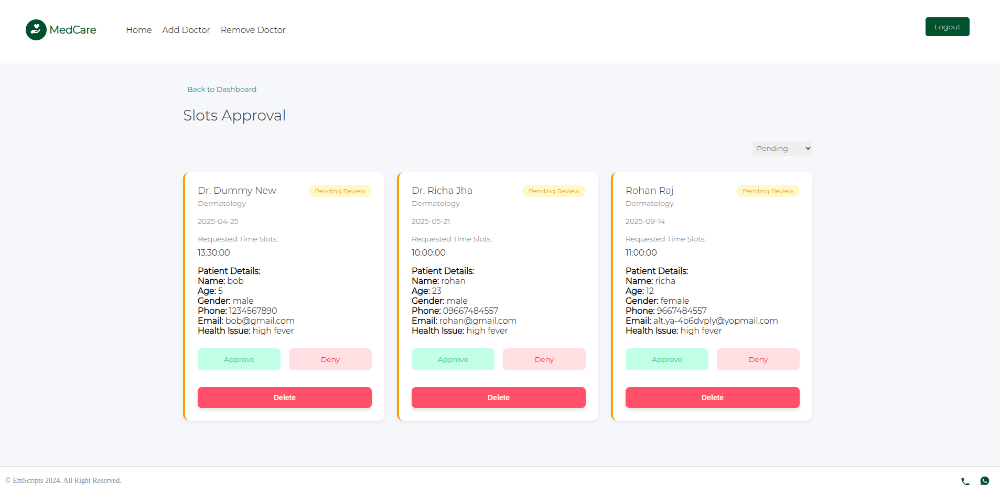

# 🩺 MedCare – Doctor Appointment Booking System

A full-stack web platform to book doctor appointments with **role-based access for Admins, Doctors, and Patients**.  
Built as part of a full-stack training program to learn authentication, scheduling, and scalable architecture.

---

## 🌐 Live Demo

- **Frontend (Patients)**: [medcare-rohnraj.vercel.app](https://doctor-appointment-system-q8td.vercel.app/)
- **Backend (APIs)**: [medcare-api-rohnraj.vercel.app](https://doctor-appointment-system-tux3.vercel.app/)
- **Admin CMS**: [medcare-admin-rohnraj.vercel.app](https://doctor-appointment-system-ingv.vercel.app/home)

---

## ✨ Features

- 🔐 Secure Authentication (Email + Google OAuth via Passport & JWT)
- 🧑‍⚕️ Doctor profiles with specialization, timings, and reviews
- 📅 Appointment booking system with available time slots
- 📝 Admin dashboard (CMS) to manage doctors and users
- 📩 Email confirmation for successful bookings
- 📱 Responsive UI and clean UX across all devices

---

## 🛠 Tech Stack

**Frontend (Patients App)**  
- Next.js, React.js

**Backend (API Server)**  
- Node.js, Express.js, PostgreSQL, Passport.js, JWT, REST APIs

**CMS (Admin Dashboard)**  
- Next.js, React.js (separate app in `/my-admin`)

**Other Tools**  
- Nodemailer (Emails)
- Vercel (Deployment)
- GitHub Actions (CI/CD)

---

## ⚙️ Folder Structure

doctor-appointment-system/
│
├── frontend/ # Next.js frontend for patients
├── backend/ # Node.js + Express + PostgreSQL APIs
├── my-admin/ # Admin CMS panel (Next.js)
└── README.md

## ⚡ Installation

### 1. Clone the repository
```bash
git clone https://github.com/rohnraj/doctor-appointment-system.git
cd doctor-appointment-system
```

### 2. Setup environment variables

Frontend (`/frontend/.env.local`)
```
NEXT_PUBLIC_API_BASE_URL=http://localhost:8080
```

Backend (`/backend/.env`)
```
PORT=8080
DATABASE_URL=your_postgres_url
JWT_SECRET=your_secret
GOOGLE_CLIENT_ID=xxxx
GOOGLE_CLIENT_SECRET=xxxx
```

Admin CMS (`/my-admin/.env.local`)
```
NEXT_PUBLIC_API_BASE_URL=http://localhost:8080
```

### 3. Install dependencies
```bash
# Frontend
cd frontend
npm install

# Backend
cd ../backend
npm install

# Admin CMS
cd ../my-admin
npm install
```

### 4. Start development servers
```bash
# Backend
cd backend
npm start

# Frontend
cd ../frontend
npm run dev

# Admin CMS
cd ../my-admin
npm run dev
```

### Now visit:

- [http://localhost:3000](http://localhost:3000) → Patient frontend
- [http://localhost:8080](http://localhost:8080) → Backend APIs
- [http://localhost:3001](http://localhost:3001) → Admin CMS

---

*** 🚀 Future Improvements ***

- Add in-app chat between patient and doctor
- Implement payment gateway for paid consultations
- Doctor availability calendar view
- Health blog
- Rating doctor

## 👤 Author

**Rohan Raj**

- 📧 [rohn.raj027@gmail.com](mailto:rohn.raj027@gmail.com)
- 💼 [LinkedIn](https://www.linkedin.com/in/rohan-raj-%F0%9F%91%8B-54a1601ab/)
- 💻 [Portfolio](https://rohnraj.github.io/) <!-- Replace with your actual portfolio URL -->

---

### Project Frontend







### Project CMS Frontend



